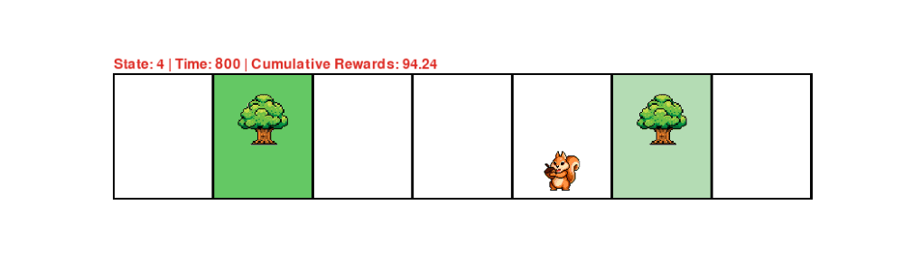

# Prospective Learning + Control (PL+C)

This repository implements various prospective learning and reinforcement learning algorithms to solve a 1D non-stationary foraging task from the L4DC 2026 paper titled [Optimal control of the future via
prospective learning with control](https://arxiv.org/pdf/2511.08717).



### Installation

This project uses `uv` for fast, reproducible dependency management.

1.  **Clone and Enter:**
    ```bash
    git clone https://github.com/ashwindesilva/procontrol.git
    cd procontrol
    ```
2.  **Sync Environment:**
    ```bash
    uv sync
    uv pip install -e .
    ```

### Replicating Experiments

The project uses a `Makefile` to standardize experiment execution. Each command runs the specified agent with optimized defaults.

#### 1. Baselines (FQI, SAC, PPO)
Run these commands to execute both standard and time-aware versions of the baselines:
* **FQI:** `make run-fqi`
* **SAC:** `make run-sac`
* **PPO:** `make run-ppo`

#### 2. Prospective Learning + Control (PL+C)
PL+C experiments are split by regressor type:
* **Neural Network (MLP):**
    ```bash
    make run-plc-nn
    ```
    *Runs with `--eval_period 100` and `--terminal_time 3000`.*
* **Random Forest:**
    ```bash
    make run-plc-rf
    ```
    *Runs with `--eval_period 50` and `--terminal_time 1000`.*

### Data & Analysis
Results are stored in the `data/` directory as `.joblib` files. 

* **Visualization:** Use `notebooks/figures.ipynb` to generate plots.
* **Animation:** Visualize the agent at work.

### Custom Arguments
If you need to override default replicates or parameters, you can pass them via the `ARGS` variable:
```bash
make run-plc-nn ARGS="--num_reps 50 --gamma 0.95"
```

### Citation

If you find this work useful, please consider citing our work.

```
@article{bai2025optimal,
  title={Optimal control of the future via prospective learning with control},
  author={Bai, Yuxin and Acharyya, Aranyak and De Silva, Ashwin and Shen, Zeyu and Hassett, James and Vogelstein, Joshua T},
  journal={arXiv preprint arXiv:2511.08717},
  year={2025}
}
```